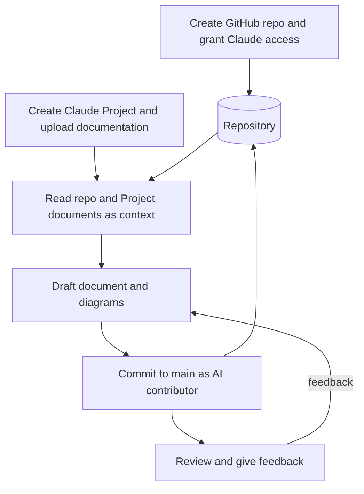

```mermaid
graph TD
    A1[Create GitHub repo and grant Claude access] --> G1[(Repository)]
    A2[Create Claude Project and upload documentation] --> B1[Read repo and Project documents as context]
    G1 --> B1
    B1 --> B2[Draft document and diagrams]
    B2 --> B3[Commit to main as AI contributor]
    B3 --> G1
    B3 --> A3[Review and give feedback]
    A3 -->|feedback| B2
```